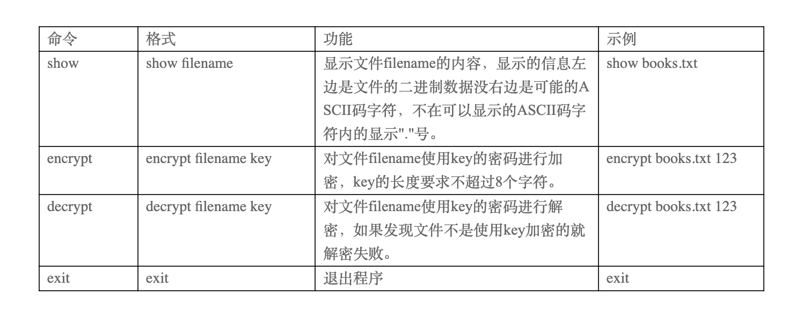
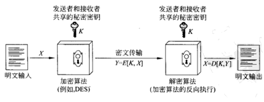

# 文件的加密解密需求说明
<pre>
需求分析:
文件加密是文件安全性的重要部分，我们设计一个程序能够对文件进行加密，然后能对文件进行解密，方便管理有敏感数据的文件。

系统概述:
程序运行后出现">"的提示符号，之后可以输入命令执行相对应的操作。程序接受下面表所示的几个命令。
</pre>

<pre>
总体设计:
    一、对称加密解密
    对称加密也称为常规加密、私钥或单钥加密。 一个对称加密由5部分组成：

    1) 明文(plaintext):这是原始信息或数据，作为算法的输入。

    2) 加密算法(encryption algorithm):加密算法对明文进行各种替换和转换。

    3) 密钥(secret key):密钥也是算法的输入。算法进行的具体替换和转换取决于密钥。

    4) 密文(ciphertext):这是产生的已被打乱的消息输出。

    5) 解密算法(decryption algorithm):本质上是加密算法的反向执行，它使用密文和同一密钥产生产生原始明文。
</pre>

<pre>
 数据加密标准（Data Encryption Standard, DES）于1977年被美国国家标准局(National Bureau of Standard, NBS)，即现在国家标准和技术协会(National Institute of Standards and Technology,NIST)采纳为联邦46（FIPS PUB 46）。这个算法本身指的是数据加密算法(Data Encryption Algorithm)。DES采用了64位的分组长度和56位的密钥长度。它将64位的经过一系列的变换得到64位的输出，解密则使用了相同的步骤和相同的密钥。

二、整数与二进制数据
在计算机中一个整数通常是4个或者8个字节的二进制数据，我们怎么样得到整数的二进制数据呢？Python中有一个struct模块，使用它的pack函数可以吧一个整数转为二进制数据，使用它的unpack函数可以把二进制数据再次反向转化为整数。使用这两个函数要设置整数的格式”@i”，其中”@”是格式引导符合，”i”代表整数。

例如：

n=100

data=struct.pack(“@i”,n)

m=struct.unpack(“@i”,data)[0]

那么data是n=100整数的二进制数据，而struct.unpack(“@i”,data)把data二进制转为整数，它返回一个元祖数据，第一个数据就是转换的整数。

一个整数到底是4个字节还是8个字节二进制数据是因系统而定的，例如在32位系统中是4字节，64位系统为8字节，具体是多少字节可以通过struct.calcsize(“@i”)得到。

 

三、加密解密数据
在Python中引入Crypto.Cipher的DES类就可以进行加密与解密

from Crypto.Cipher import DES

加密时要求密码key是8个字节的二进制数据，被加密的二进制数据data的长度必须是8的倍数，然后使用DES.new创建一个DES的对象des，再调用des.encrypt就可以加密数据data：

    des = DES.new(key, DES.MODE_ECB)

    encrypted_data=des.encrypt(data)

解密时同样用相同的8个字节的二进制密码key创建一个DES对象des，然后调用des.decrypt就可以进行解密：

    des = DES.new(key, DES.MODE_ECB)

    data=des.decrypt(encrypted_data)

由于加密时要求被加密的数据data的长度时8的倍数，因此我们常常可以在data后面补"\x00"来使得data长度变成8倍数，但是解密时为了知道原始数据的长度是多少，因此可以设计一个整数的二进制数据来指定原始数据的长度。

 

1、加密过程

(1) 密码key是8字节长的二进制数据；

(2) 加密的二进制数据data长度count，如果count不是8的倍数就通过补"\x00"增加data使得长度是8的倍数；

(3) 使用DES加密data数据得到encrypted_data；

(4) 使用md5获取key的16字节的哈希编码hash；

(5) 把count整数转为一个二进制序列head；

(6) 组合encrypted=hash+head+encrypted_data成为加密数据；

(7) 由于数据的MD5哈希值是不可逆的，我们把它放在加密文件的前面就是为了解密时判断这个数据是否是指定的key加密得到的，从而完进行解密过程。

 

2、解密过程

(1) 密码key是8字节长的二进制数据；

(2) 使用md5获取key的16字节的哈希编码hash；

(3) 检查encrypted的前16个字节是否是这个hash，如果不是就说明该数据不是key加密的结果，不能解密，如果是就继续解密；

(4) 从组合encrypted=hash+head+encrypted_data分解出hash、head、encrypted_data；

(5) 使用DES解密encrypted_data数据得到data；

(6) 把head转为整数count；

(7) 从data中取出前面count个字节，这就是原始数据，完成解密。

 

一般情况下一个key产生唯一的一个MD5哈希值，当然不同的两个key值也可能产生相同的MD5哈希值，但是这种情况的概率十分小，因此还是可以这样做的。如果不把这个哈希值放在文件开头，使用一个不正确的密码来解密，那么解密过程是能进行的，但是解密出来的数据就面目全非了，还原不到原来的数据，因此解密时判断该密码是否正确是十分有必要的。

利用hashlib生成key的哈希值
    import hashlib
    key = b'12345678'
    md5 = hashlib.md5()
    md5.update(key)
    hash = md5.digest()
    print(hash)

程序测试
程序测试文件books.txt的加密与解密过程，使用的密码时123：

>show books.txt

31 32 33 0d 0a 50 79 74 68 6f 6e 0d 0a 4a 61 6d      123..Python..Jam

65 73 0d 0a 4e 2e 59 0d 0a                           es..N.Y..       

>encrypt books.txt 123

文件加密成功!

>show books.txt

43 db a8 3a 0c f9 75 64 bd 70 42 f7 64 b2 86 cf      C..:..ud.pB.d...

19 00 00 00 ec 83 3e a8 a1 2e e2 fa c9 c2 00 0a      ......>.........

d9 12 2e 0d 41 c6 9c cc 99 33 9c f1 f8 2e 92 4e      ....A....3.....N

94 10 70 0e                                          ..p.            

>decrypt books.txt abc

文件解密错误!

>decrypt books.txt 123

文件解密成功!

>show books.txt

31 32 33 0d 0a 50 79 74 68 6f 6e 0d 0a 4a 61 6d      123..Python..Jam

65 73 0d 0a 4e 2e 59 0d 0a                           es..N.Y..           
</pre>