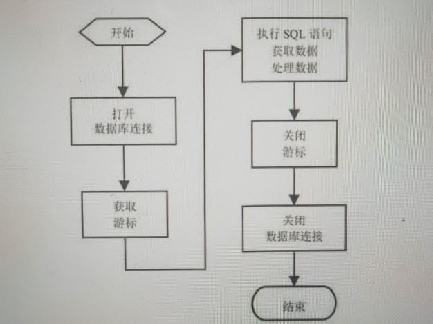

# Python数据库API简介
> 虽然Python需要为操作不同的数据库使用不同的模块，但不同的模块并非没有规律可循 
  因为他们都遵守Python制定的DB API协议，因此数据库模块有很多操作其实都是相同的。 
  下面介绍不同数据库模块之间的通用内容。

## 全局变量
> Python推荐支持DB API 2.0的数据库模块都应该提供如下3个全局变量
<pre>
    > apilevel:该全局变量显示数据库模块的API版本号。对于支持DB API2.0版本的数据库
      模块来说，该变量值通常就是2.0.如果这个变量不存在，则可能该数据库模块暂时还不支
      持DB API 2.0。这时我们应该考虑选择使用支持该数据库的其他数据库模块。
    
    > threadsafety:该全局变量指定数据库模块的线程安全等级，该等级值为0～3,其中3 代表该
      模块完全是线程安全的;1 表示该模块具有部分线程安全性，线程可以共享该模块，但不能
      共享连接;0 则表示线程完全不能共享该模块。
    
    > paramstyle:该全局变量指定当SQL语句需要参数时，可以使用哪种风格的参数。该变量可能
      返回如下变量值:
        1.format:表示在SQL语句中使用Python标准的格式化字符串代表参数。例如
          在程序中需要参数的地方使用%s，接下来程序即可为这些参数制定参数值。
        2.pyformat:表示在SQL语句中使用扩展的格式代码代表参数。比如使用%(name)
          这样即可使用包含key为name的字典为该参数制定参数值。
        3.qmark:表示在SQL语句中使用问号(?)代表参数。在SQL语句中有几个参数，全部
          用问号代替。
        4.numeric:表示在SQL语句中使用数字占位符(:N)代表参数。例如1 代表一个参数
          2 也表是一个参数，这些数字想但与参数名，因此它们不一定需要连续。
        5.named:表示在SQL语句中使用命名占位符(:name)代表参数。例如:name代表
          一个参数，:age也表示一个参数。
</pre>

## 数据库API的核心类
> 遵守DB API 2.0 协议的数据库模块通常会提供一个connect()函数，该函数用于连接数据库 
  并返回数据库连接对象。

<pre>
> 数据库连接对象通常会具有如下方法和属性:
    1.cursor(factory=Cursor):打开游标。
    2.commit():提交事务。
    3.rollback():回滚事物。
    4.close():关闭数据库连接。
    5.isolation_level:返回或设置数据库连接中事务的隔离级别。
    6.in_transaction:判断当前是否处于事物中。
上面的第一个方法可以返回一个游标对象，游标对象是Python DB API的核心对象，该对象主要
用于执行各种SQL语句，包括DDL、DML、select查询语句等。使用游标执行不同的SQL语句返回
不同的数据。

> 游标对象通常会具有如下方法和属性:
    1.execute(sql[,parameters]):执行SQL语句。parameters参数用于为SQL语句中的
      参数指定值。
    2.executemany(sql,seq_of_parameters):重复执行SQL语句。可以通过seq_of_parameters
      序列为SQL语句中的参数指定值，该序列有多少个元素，SQL语句就被执行多少次。
    3.executescript(sql_script):这不是DB API 2.0的标准方法。该方法可以直接执行
      多条SQL语句的SQL脚本。
    4.fetchone():获取查询结果集的下一行。如果没有下一行，则返回None。
    5.fetchmany(size=cursor.arraysize):返回查询结果集的下N行组成的列表。如果
      没有更多的数据行，则返回空列表。
    6.fetchall():返回查询结果集的全部行组成的列表。
    7.close():关闭游标。
    8.rowcount:该只读属性返回受SQL语句影响的行数。对于executemany()方法，该方法
      所修改的记录条数也可以通过该属性获取。
    9.lastrowid:该只读属性可获取最后修改的rowid。
    10.arraysize:用于设置或获取fetchmany()默认获取的记录条数，该属性默认为1.有些
       数据模块没有该属性。
    11.description:该属性可获取最后一次查询返回的所有列表信息。
    12.connection:该只读属性返回创建游标的数据库连接对象。有些数据库模块没有该属性。
总结来看，Python的DB API 2.0由一个connect()开始，一共涉及数据库连接和游标的两个核心
API,它们的分工如下:
    > 数据库连接:用于获取游标、控制事务
    > 游标:执行各种SQL语句
掌握上面这些API之后，接下来可以大致归纳出Python DB API 2.0的编程步骤。
</pre>

## 操作数据库的基本流程

> 使用Python DB API 2.0操作数据的基本流程如下: 
    1.调用connect()方法打开数据库连接，返回该方法的数据库连接对象。 
    2.通过数据库连接对象打开游标。 
    3.使用游标执行SQL语句(包括DDL、DML、select等)如果执行的是查询语句，则处理查询数据。 
    4.关闭游标。 
    5.关闭数据库连接。 

> 下图显示了使用Python DB API 2.0操作数据库的基本流程。

      