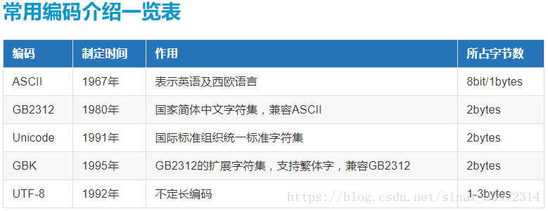
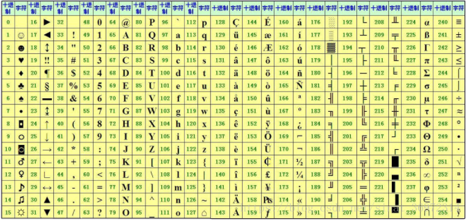
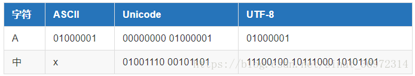
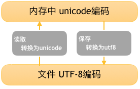
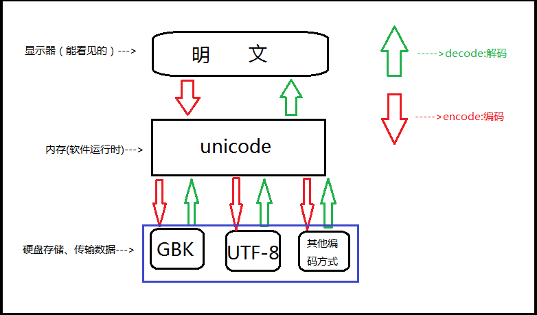

#Python常见字符编码及其之间的转换
> 一、Python常见字符编码 

字符编码的常用种类介绍 

第一种：ASCII码
ASCII（American Standard Code for Information Interchange，美国信息交换标准代码）是基于拉丁字母的一套电脑编码系统，主要用于显示现代英语和其他西欧语言。它是现今最通用的单字节编码系统，并等同于国际标准ISO/IEC 646。如下图所示：

由于计算机是美国人发明的，因此，最早只有127个字母被编码到计算机里，也就是大小写英文字母、数字和一些符号，这个编码表被称为ASCII编码，比如大写字母 A的编码是65，小写字母 a的编码是97。后128个称为扩展ASCII码。
在这里，每一位0或者1所占的空间单位为bit(比特)，这是计算机中最小的表示单位，每8个bit组成一个字符，这是计算机中最小的存储单位。
常见换算单位：
bit 位，计算机中最小的表示单位
8bit = 1bytes 字节，最小的存储单位，1bytes缩写为1B
1KB=1024B
1MB=1024KB
1GB=1024MB
1TB=1024GB

第二种：GBK 和 GB2312
对于我们来说能在计算机中显示中文字符是至关重要的，然而ASCII表里连一个偏旁部首也没有。所以我们还需要一张关于中文和数字对应的关系表。一个字节只能最多表示256个字符，要处理中文显然一个字节是不够的，所以我们需要采用两个字节来表示，而且还不能和ASCII编码冲突，所以，中国制定了GB2312编码，用来把中文编进去。

第三种：Unicode
但如以来，就会出现一个问题，各个国家都一套自己的编码，就不可避免会有冲突，这是该怎么办呢？
因此，Unicode应运而生。Unicode把所有语言都统一到一套编码里，这样就不会再有乱码问题了。
Unicode标准也在不断发展，但最常用的是用两个字节表示一个字符（如果要用到非常偏僻的字符，就需要4个字节）。现代操作系统和大多数编程语言都直接支持Unicode。　　　
现在，分析一下ASCII编码和Unicode编码的区别：
ASCII编码是1个字节，而Unicode编码通常是2个字节。
字母A用ASCII编码是十进制的65，二进制的01000001；
字符0用ASCII编码是十进制的48，二进制的00110000；
汉字“中”已经超出了ASCII编码的范围，用Unicode编码是十进制的20013，二进制的01001110 00101101。
如果把ASCII编码的A用Unicode编码，只需要在前面补0就可以，因此，A的Unicode编码是00000000 01000001。
但如果统一成Unicode编码，乱码问题从此消失了。但是，如果你写的文本基本上全部是英文的话，用Unicode编码比ASCII编码需要多一倍的存储空间，在存储和传输上就十分不划算。

第四种：UTF-8
基于节约的原则，出现了把Unicode编码转化为“可变长编码”的UTF-8编码。UTF-8编码把一个Unicode字符根据不同的数字大小编码成1-6个字节，常用的英文字母被编码成1个字节，汉字通常是3个字节，只有很生僻的字符才会被编码成4-6个字节。如果你要传输的文本包含大量英文字符，用UTF-8编码就能节省空间了。如下所示：

从上面的表格还可以发现，UTF-8编码有一个额外的好处，就是ASCII编码实际上可以被看成是UTF-8编码的一部分，所以，大量只支持ASCII编码的历史遗留软件可以在UTF-8编码下继续工作。
我们总结一下现在计算机系统通用的字符编码工作方式：
在计算机内存中，统一使用Unicode编码，当需要保存到硬盘或者需要传输的时候，就转换为UTF-8编码。
用记事本编辑的时候，从文件读取的UTF-8字符被转换为Unicode字符到内存里，编辑完成后，保存的时候再把Unicode转换为UTF-8保存到文件。如下图：

二、Python常见字符编码间的转换

（一）Unicode和UTF-8

Unicode 起到了2个作用：
直接支持全球所有语言，每个国家都可以不用再使用自己之前的旧编码了，用unicode就可以了。(就跟英语是全球统一语言一样)
unicode包含了跟全球所有国家编码的映射关系。
Unicode解决了字符和二进制的对应关系，但是使用unicode表示一个字符，太浪费空间。例如：利用unicode表示“Python”需要12个字节才能表示，比原来ASCII表示增加了1倍。由于计算机的内存比较大，并且字符串在内容中表示时也不会特别大，所以内容可以使用unicode来处理，但是存储和网络传输时一般数据都会非常多，那么增加1倍将是无法容忍的。
为了解决存储和网络传输的问题，出现了Unicode Transformation Format，学术名UTF，即：对unicode中的进行转换，以便于在存储和网络传输时可以节省空间。

UTF-8： 使用1、2、3、4个字节表示所有字符；优先使用1个字符、无法满足则使增加一个字节，最多4个字节。英文占1个字节、欧洲语系占2个、东亚占3个，其它及特殊字符占4个。
UTF-16： 使用2、4个字节表示所有字符；优先使用2个字节，否则使用4个字节表示。
UTF-32： 使用4个字节表示所有字符。

总结：UTF 是为unicode编码 设计 的一种 在存储 和传输时节省空间的编码方案。

（二）字符在硬盘上的存储

首先要明确的一点就是，无论以什么编码在内存里显示字符，存到硬盘上都是2进制。
比如：　　　　
ascii编码(美国)：
l   0b1101100
o   0b1101111
v   0b1110110

e   0b1100101

GBK编码(中国)：
老   0b11000000 0b11001111
男   0b11000100 0b11010000
孩   0b10111010 0b10100010

还要注意的一点是，存到硬盘上时是以何种编码存的，再从硬盘上读出来时，就必须以何种编码读(开头声明或转换)，要不然就乱了。

（三）编码的转换

虽然有了unicode and utf-8 ，但是由于历史问题，各个国家依然在大量使用自己的编码，比如中国的windows,默认编码依然是gbk,而不是utf-8。基于此，如果中国的软件出口到美国，在美国人的电脑上就会显示乱码，因为他们没有gbk编码。所以该怎么办呢？还记得我们讲unicode其中一个功能是其包含了跟全球所有国家编码的映射关系，这时就派上用场了。无论你以什么编码存储的数据，只要你的软件在把数据从硬盘读到内存里，转成unicode来显示，就可以了。由于所有的系统、编程语言都默认支持unicode，那你的gbk软件放到美国电脑上，加载到内存里，变成了unicode,中文就可以正常展示啦。　

Python3执行过程
解释器找到代码文件，把代码字符串按文件头定义的编码加载到内存，转成unicode，把代码字符串按照语法规则进行解释，所有的变量字符都会以unicode编码声明。在py3上 把你的代码以utf-8编写， 保存，然后在windows上执行，发现可以正常执行。其实utf-8编码之所以能在windows gbk的终端下显示正常，是因为到了内存里python解释器把utf-8转成了unicode , 但是这只是python3, 并不是所有的编程语言在内存里默认编码都是unicode,比如 万恶的python2 就不是， 是ASCII，想写中文，就必须声明文件头的coding为gbk or utf-8, 声明之后，python2解释器仅以文件头声明的编码去解释你的代码，加载到内存后，并不会主动帮你转为unicode,也就是说，你的文件编码是utf-8,加载到内存里，你的变量字符串就也是utf-8, 这意味着什么？意味着，你以utf-8编码的文件，在windows是乱码。
其实乱是正常的，不乱才不正常，因为只有2种情况 ，你的windows上显示才不会乱。
Python2并不会自动的把文件编码转为unicode存在内存里。
字符串以GBK格式显示
字符串是unicode编码
所以我们只有手动转，Python3 自动把文件编码转为unicode必定是调用了什么方法，这个方法就是，decode(解码) 和encode(编码)。
方法如下：
　　UTF-8 --> decode 解码 --> Unicode

　　Unicode --> encode 编码 --> GBK / UTF-8

规则如下：

（四）Python bytes 类型

把8个二进制一组称为一个byte,用16进制来表示。为的就是让人们看起来更可读。我们称之为bytes类型，即字节类型。

python2的字符串其实更应该称为字节串。 通过存储方式就能看出来， 但python2里还有一个类型是bytes，难道又叫bytes又叫字符串？是的，在python2里，bytes == str ， 其实就是一回事。除此之外， python2里还有个单独的类型是unicode , 把字符串解码后，就会变成unicode。

Python2的默认编码是ASCII码，当后来大家对支持汉字、日文、法语等语言的呼声越来越高时，Python于是准备引入unicode,但若直接把默认编码改成unicode的话是不现实的， 因为很多软件就是基于之前的默认编码ASCII开发的，编码一换，那些软件的编码就都乱了。所以Python 2就直接用了一个新的字符类型，就叫unicode类型，比如你想让你的中文在全球所有电脑上正常显示，在内存里就得把字符串存成unicode类型。

Python3 除了把字符串的编码改成了unicode, 还把str 和bytes 做了明确区分， str 就是unicode格式的字符， bytes就是单纯二进制啦。
在py3里看字符，必须得是unicode编码，其它编码一律按bytes格式展示。

Python只要出现各种编码问题，无非是哪里的编码设置出错了。

常见编码错误的原因有以下这些：　
Python解释器的默认编码
Python源文件文件编码
Terminal使用的编码
操作系统的语言设置

最后总结一下：
python3:文件默认编码是utf-8,字符串编码是unicode以utf-8或者gbk等编码的代码,加载到内存,会自动转为unicode正常显示。

python2:文件默认编码是ascii , 字符串编码也是 ascii , 如果文件头声明了是gbk，那字符串编码就是gbk。以utf-8 或者 gbk等编码的代码，加载到内存，并不会转为unicode,编码仍然是utf-8或者gbk等编码。

