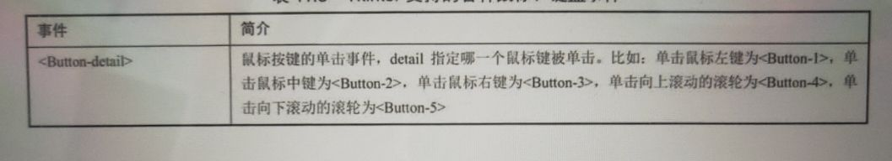
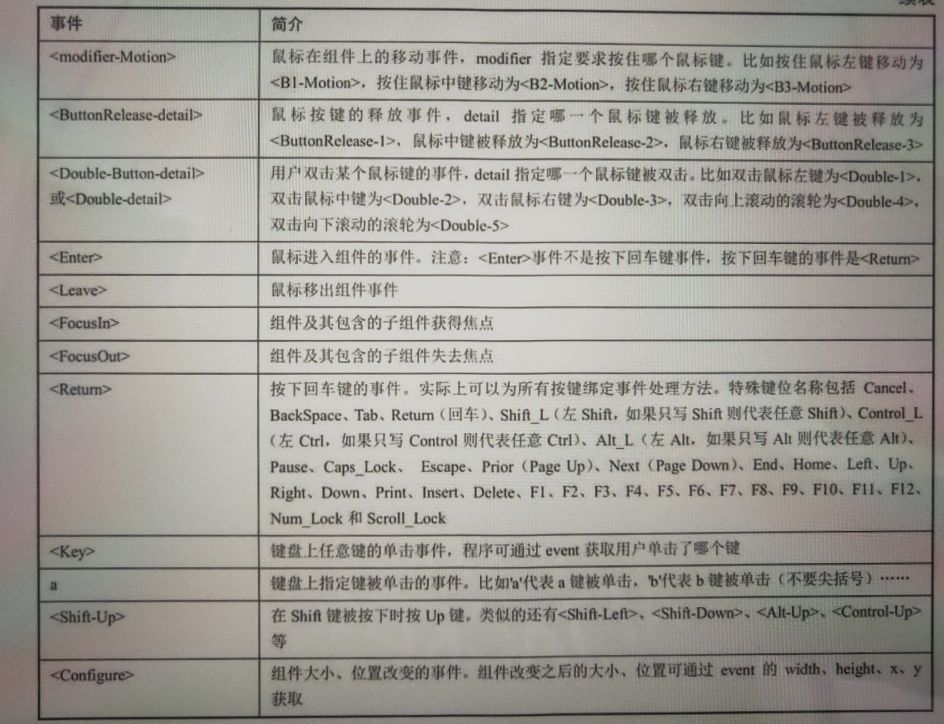

#simple_bind.py程序解析

> 从simple_bind.py这个例子可以看到，Tkinter直接使用字符串来代表事件类型，比如
  使用<Button-1>代表鼠标左键来单击事件，使用<Double-1>代表鼠标左键来双击事件。
  那么问题来了，其他事件应该怎么写呢?

> 代表Tkinter事件的字符串大致遵循如下格式:
        
        '''
        <modifier-type-detail>
        '''

> 其中type是事件字符串的关键部分，用于描述事件的种类，比如鼠标事件、键盘事件等;modifer
  则代表事件的修饰部分，比如单击、双击等；detail用于指定事件的详情，比如指定鼠标左键
  右键、滚轮等。

> 下图展示了Tkinter支持的各种鼠标、键盘事件。

