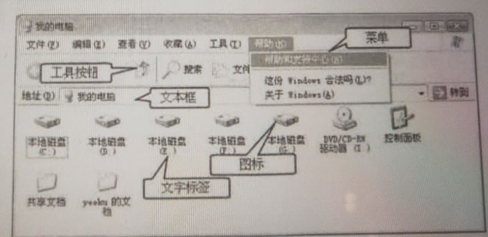
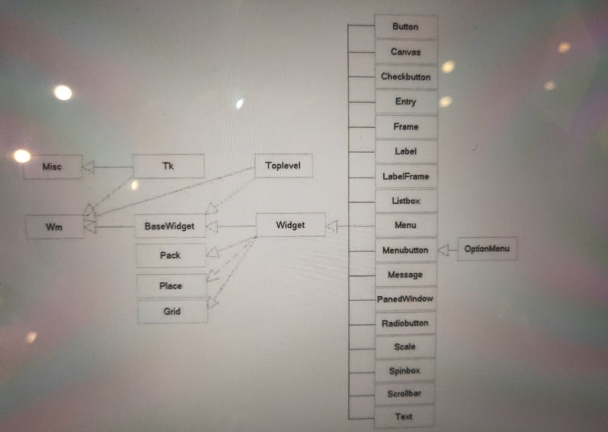
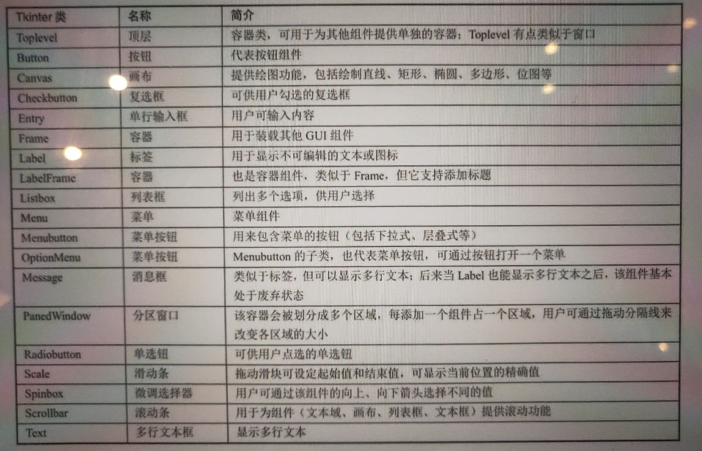

#Tkinter GUI 编程的组件

> 如果从程序员的角度来看一个窗口，这个窗口不是一个整体，而是由多个部分组合而成的 

> 从上图中可以看出，任何窗口都可以被分解成一个空的容器，容器里装了大量的基本组件，通过
  设置这些组件的大小、位置等属性，就可以将空的容器和基本组件组成一个整体窗口。实际上
  图形编程很简单，它非常类似于小朋友玩的拼图游戏，容器类似于拼图的“母版”，而普通组件
  (如Button、ListBox之类的)则类似于拼图的图块。创建图形用户界面的过程就是完成拼图的
  过程。

> 使用Tkinter进行GUI编程与其他语言的GUI编程基本相似，都是使用不同的“积木块”来堆处各种
  各样的界面。因此，学习GUI编程的总体步骤大致可分为三步。
<pre>
    1.了解GUI库大致包含哪些组件，就相当于熟悉每个积木块到底是些什么东西。
    2.掌握容器及容器对组件进行布局的方法，就相当于掌握拼图的”母板“，以及母板怎么固定
      积木块的方法。
    3.逐个掌握各组件的用法，则相当于深入掌握每个积木块的功能和用法
</pre>

> 下面我们先完成第一步，大致了解Tkinter库包含的各GUI组件。由于这些组件之间存在错综复杂的继承关系
  因此我们先通过类图来了解各GUI组件，以及它们之间的关系。

> Tkinter的GUI组件之间的继承关系如上图
  从上图中可以看出，Tkinter的GUI组件有两个根父类，它们都直接继承了object类
<pre>
    > Misc: 它是所有组件的根父类
    > Wm: 它主要提供了一些与窗口管理器通信的功能函数
</pre>

> 对于Misc和Wm两个类而言，GUI编程并不需要直接使用它们，但由于它们是所有GUI组件的父类，因此GUI组件
  都可以直接使用它们的方法。

> Misc和Wim派生了一个字类:Tk,它代表应用程序的主窗口。因此，所有Tkinter GUI编程通常都需要直接或间
  接使用该窗口类

> BaseWidget是所有组件的基类，它还派生了一个字类:Widget。Widget代表一个通用的GUI组件，Tkinter所有的
  GUI组件都是Widget的子类。

> 再来看Widget的父类。Widget一共有4个父类，除了BaseWidget之外，还有Pack、Place和Grid,这三个父类都是
  布局管理器，它们负责管理所有包含的组件的大小的位置

> 上表简单介绍了各GUI组件的功能。
